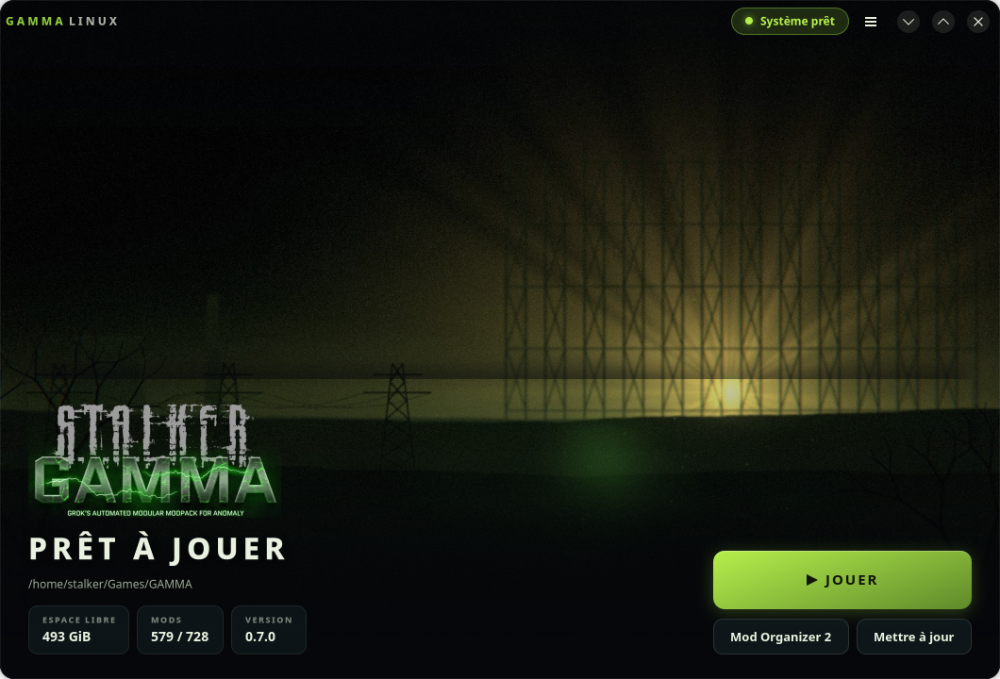
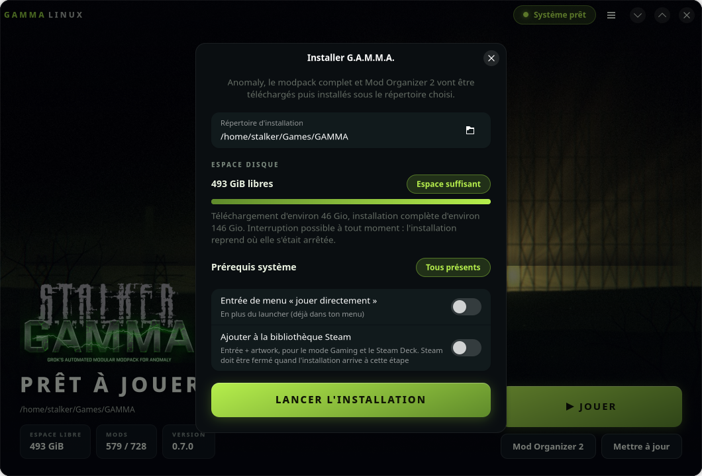
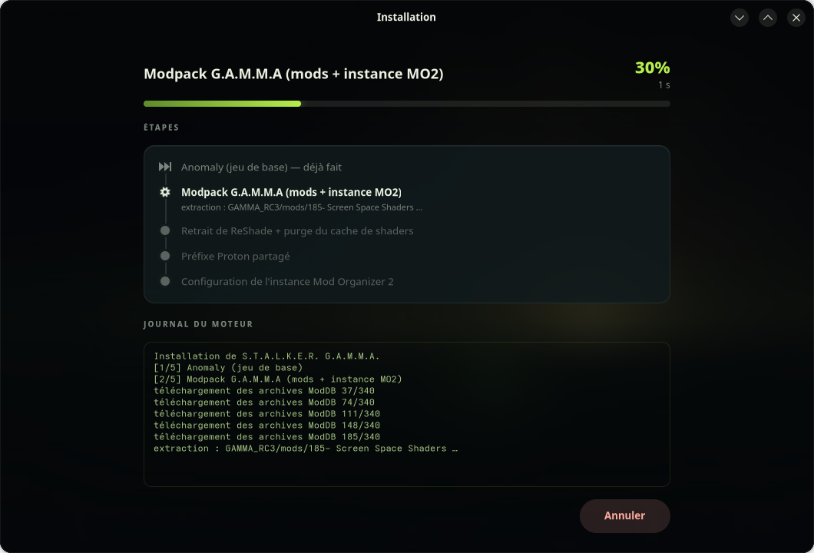

# stalker-gamma-linux

[](https://github.com/Fleorens/stalker-gamma-linux/actions/workflows/ci.yml)

**Install [S.T.A.L.K.E.R. G.A.M.M.A.](https://github.com/Grokitach/Stalker_GAMMA)
on Linux with one command** — Mod Organizer 2 under Proton, your mods still
enable/disable like on Windows.



The game itself (Anomaly, X-Ray Monolith engine) already runs great under Proton.
Everything *around* it is the problem: the official launcher is .NET + PowerShell,
Mod Organizer 2 needs a careful Wine/Proton setup, and the community route is a
long manual checklist. Same install, before and after:

| By hand ([INSTALL-MANUAL.md](docs/INSTALL-MANUAL.md), the spec this project automates) | With this project |
|---|---|
| 8 documented steps, plus a page of known traps | `curl … \| bash`, then one window |
| ≈ 160 GiB of downloads to shepherd yourself | Progress, disk check and resume built in |
| Official launcher: .NET + PowerShell, Windows-only | Native GTK4/libadwaita launcher |
| Proton prefix, DLL injection, winetricks verbs by hand | Shared prefix provisioned — and repairable (`prefix-doctor --repair`) |
| MO2 `gamePath` and profile edited by hand in `ModOrganizer.ini` | Configured for you, USVFS diagnosed after launch |
| Interrupted mid-way? Start over | Resumable: rerun, completed steps are skipped |
| "works on my distro" | Exercised in CI on Fedora, Arch, Debian 12 and Ubuntu 24.04 on every push |

This project is the **Linux integration layer** that makes GAMMA a one-command
(and eventually one-click) install:

- One-shot installer: prerequisites check → Anomaly → GAMMA modpack → Proton prefix → desktop shortcut
- **Mod Organizer 2 running under Proton as the primary mode** — you keep full
  mod flexibility (enable/disable/add mods), exactly like on Windows
- Incremental updates that follow upstream GAMMA releases
- Runs on any Linux distribution — the installer is exercised in CI on **Fedora,
  Arch, Debian 12 and Ubuntu 24.04** containers on every push; other distros are
  expected to work but aren't tested automatically. Steam Deck included.
- GUI on top (GTK4/libadwaita), installed natively (no Flatpak/AppImage sandbox)

## How it works

We do **not** reimplement the modpack installation logic. The download/install
engine is [Mord3rca/gamma-launcher](https://github.com/Mord3rca/gamma-launcher)
(Python, GPL-3.0), which already handles ModDB mirror resolution, the GAMMA
modlist, extraction directives and MD5 verification. This project wraps it with
everything Linux-specific. See [docs/ARCHITECTURE.md](docs/ARCHITECTURE.md).

## Status

🚧 Phase 1 (MVP) implemented and validated on a real machine; the GTK4/
libadwaita GUI (Phase 2) is implemented and tested on a real machine too;
install is native only (`install.sh`, no Flatpak/AppImage); CI (lint, types,
tests, release tagging, daily upstream-regression watch) is wired up — see
[docs/ROADMAP.md](docs/ROADMAP.md), [docs/CI.md](docs/CI.md) and
[tasks/](tasks/) for the work breakdown.

## Usage

### Install

The recommended install is **one command** that sets up a native environment
and **opens the installer GUI** — the actual installation experience:

```sh
curl -fsSL https://raw.githubusercontent.com/Fleorens/stalker-gamma-linux/main/install.sh | bash
```

No `sudo`, nothing written outside your home. It bootstraps a
`--system-site-packages` venv under `~/.local/share/stalker-gamma-linux/`,
installs the package, adds a **GAMMA Linux Launcher** entry to your app menu,
and launches the GUI. The window drives the rest: live prerequisite diagnostic,
install target, download/install, then Play. Already have a checkout?
`./install.sh` does the same without cloning; `--no-launch` sets everything up
without opening the window.

### Uninstall

```sh
~/.local/share/stalker-gamma-linux/src/install.sh --uninstall   # or ./install.sh --uninstall from a checkout
```

Removes the venv, both commands, the menu entry, the icon, your settings and
the logs. **Your game install is never touched** — the script tells you where
it is so you can delete it yourself. To remove it too, in one step:

```sh
stalker-gamma-linux uninstall --game-data    # irreversible: Anomaly, mods, cache, prefix and saves
stalker-gamma-linux uninstall --dry-run      # shows exactly what would go, deletes nothing
```

`--game-data` asks for an explicit `yes` before deleting (the resolved path
and estimated size are shown first); add `--yes` to skip the prompt in
scripts.

`umu-run` is deliberately left in place: it is a general-purpose launcher that
other games may rely on.

Running **natively** (not sandboxed) is deliberate: this tool orchestrates your
system's Wine/Proton, umu, libunrar, Steam and 32-bit stack — the native GUI
uses them directly, with none of the bundling/sandbox workarounds a Wine
launcher would need in a container.

**Prerequisites** (the GUI's Diagnostic tab shows them live):
- **GTK4 + libadwaita 1.5+ + PyGObject** — for the GUI itself, the one thing the
  script can't set up without `sudo` (PyGObject has no pip wheel; it comes from
  your distro). **Debian 12 ships libadwaita 1.2 and cannot run the graphical
  launcher** — the CLI works fine there; the GUI needs Debian 13, Ubuntu 24.04+,
  Fedora or Arch. `doctor` tells you which case you're in. Fedora: `sudo dnf install gtk4 libadwaita python3-gobject` ·
  Debian/Ubuntu: `sudo apt install gir1.2-gtk-4.0 gir1.2-adw-1 python3-gi` ·
  Arch: `sudo pacman -S gtk4 libadwaita python-gobject`. If they're missing the
  script prints the exact command for your distro.
- **umu-launcher** — **installed automatically**, nothing to do. It is the
  one prerequisite with no PyPI package (`pipx install umu-launcher` 404s)
  and no package in the Fedora/Debian/Ubuntu repos, so the tool handles it
  itself: `install.sh` (and the **Install** button in the GUI's Diagnostic
  view, and `stalker-gamma-linux install-umu`) downloads the official
  ~420 KiB [zipapp release](https://github.com/Open-Wine-Components/umu-launcher/releases)
  and drops `umu-run` into `~/.local/bin` — no sudo. Prefer a real package?
  Arch: `sudo pacman -S umu-launcher`; Fedora/Debian: upstream publishes
  `.rpm`/`.deb` files on the same releases page.
- `7z` and `libunrar` are needed for the install itself (shown in the
  Diagnostic with the exact command for your distro). Steam, protontricks
  and Vulkan drivers are **optional**: the pipeline runs everything through
  umu (own runtime, Proton-GE fetched from GitHub) — Steam only matters for
  Steam Input / Gaming Mode on the Deck, Vulkan only to actually play.
- [**GameMode**](https://github.com/FeralInteractive/gamemode) is optional too,
  and used automatically when present: `play` wraps the launch in
  `gamemoderun`, which is what actually *requests* the mode (the daemon is
  D-Bus-activated, so `gamemoded -s` saying « inactive » between sessions is
  normal, not a bug to fix with `systemctl enable`). Opt out with
  `play --no-gamemode` or the switch in the GUI's Preferences. On Fedora and
  Arch the CPU-governor part is reserved to members of the `gamemode` group by
  a polkit rule, and fails silently otherwise — `doctor` detects that and gives
  you the one-time `usermod` command (effective on the next launch: polkit reads
  the group from the system database, so no re-login needed).

Once installed (or with the venv activated), the CLI is `stalker-gamma-linux`:

```sh
stalker-gamma-linux doctor                       # system prerequisites + prefix + install state
stalker-gamma-linux install                      # anomaly → GAMMA → prefix → MO2 → (default target: ~/Games/stalker-gamma)
stalker-gamma-linux install --target /mnt/disk --shortcut   # custom disk, + desktop entry
stalker-gamma-linux import /path/to/existing     # adopt an install already on disk — no re-download
stalker-gamma-linux play                         # launch Anomaly through MO2 (USVFS, mods active, GameMode if installed)
stalker-gamma-linux mo2                          # open Mod Organizer 2 itself (enable/disable mods)
stalker-gamma-linux update                       # update the modpack, re-verify, remove ReShade again if needed
stalker-gamma-linux shortcut                     # (re)create the .desktop menu entry
stalker-gamma-linux install --only prefix        # replay one step (troubleshooting), even if done
stalker-gamma-linux prefix-doctor --repair        # repair the shared Proton prefix in place
stalker-gamma-linux uninstall                    # remove shortcuts/settings/logs (keeps the game)
stalker-gamma-linux doctor --report              # write a report to attach to an issue
```

**Already have GAMMA on disk?** Don't download it twice. `stalker-gamma-linux
import /path/to/it` finds Anomaly and the Mod Organizer 2 instance by their
markers, adopts them where they are (symlinks if the layout differs — nothing is
copied or moved), and marks the downloads as done. `install` then only does what
is actually missing: ReShade removal, Proton prefix, MO2 configuration,
shortcut. Works for a manual install, a folder shared with a Windows dual-boot,
and for the [GOG one-click GAMMA that gets stuck in
Heroic](https://github.com/Heroic-Games-Launcher/HeroicGamesLauncher/issues/5063)
after downloading its 130 GB. Add `--dry-run` to see what it would adopt.

**Reporting a problem?** Run `stalker-gamma-linux doctor --report` (or click the
save icon in the GUI's Diagnostic view). It writes a single file with your
prerequisites, prefix state, installed Proton builds and the end of the log,
with paths anonymized to `~` — attach that to the issue and skip the
back-and-forth. `stalker-gamma-linux --version` alone prints the version plus
the exact revision installed, which is what pins down *which* code you're on
between releases.

Every command has `--help`. `install` is resumable: interrupt it (Ctrl-C) and
rerun the same command — steps already completed (tracked in
`~/.config/stalker-gamma-linux/install-state.toml`) are skipped. Pass
`--verbose` (before the subcommand, e.g. `stalker-gamma-linux --verbose play`)
for debug output on the console; a full rotating log is always kept under
`~/.local/state/stalker-gamma-linux/`.

### GUI

The GUI (`stalker-gamma-linux-gui`) is a real **launcher**, not a generic
settings window: procedurally generated Zone artwork, the GAMMA logo, a big
PLAY/INSTALL button, and everything you need to know at a glance — install
target, free disk space on that volume, and a live "system ready / N
prerequisites missing" chip that opens the full Diagnostic view.

| | |
|---|---|
|  |  |

- **Guided install** — before anything is downloaded, a dialog shows the
  target directory, the free space on that volume with a colored verdict
  (enough / tight / insufficient — installation is blocked under 160 GiB,
  ~250 GiB recommended), and lets you pick another disk.
- **Real progress** — the install pipeline is rendered as a phase timeline
  (done / already done / running with live engine detail / pending), a real
  progress fraction (no fake pulsing bar), elapsed time, and an embedded
  console with the full engine log. Cancelling is clean and resuming skips
  validated steps.
- **Diagnostic** — same data as `doctor`, one glance verdict on top,
  copy-paste remediation commands per distro.

It needs GTK4 + libadwaita + PyGObject from your distribution (not
pip-installable — no manylinux wheel exists for PyGObject); running the
command without them prints the install command for your distro instead of
a raw traceback. It calls the exact same `orchestrator`/`mo2` code as the
CLI — no duplicated install logic — and never blocks the UI thread during a
download. The CLI remains fully independent and usable on its own.

The background artwork is generated deterministically by
`scripts/generate_background.py` (numpy + Pillow, fixed seed) — no external
asset, reproducible at any time.

### Language

The CLI and GUI are in **English by default**, regardless of your system
locale. To switch language, set `LANGUAGE` explicitly, e.g.
`LANGUAGE=fr stalker-gamma-linux doctor`. French is fully translated today;
contributing another language is a normal gettext workflow, see
"Internationalisation" in `docs/ARCHITECTURE.md`.

## Legal

This repository contains **code and documentation only**. It never rehosts the
game, Anomaly, or any mod: everything is downloaded client-side from ModDB /
GitHub, exactly like the official GAMMA launcher does. All credit for GAMMA
goes to Grokitach and the modders listed at [stalker-gamma.com](https://stalker-gamma.com).

License: [GPL-3.0](LICENSE).
